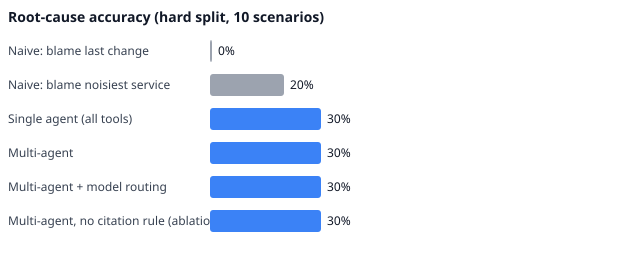
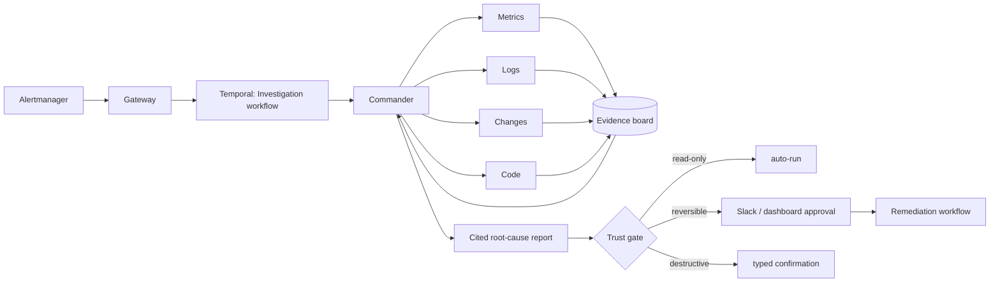

# Nightshift: an AI on-call engineer that survives its own crashes

> A multi-agent incident investigator that resumes after worker crashes, never acts without permission, and is scored on a public benchmark of 40 injected production failures (plus a 10-scenario hard set).

When an alert fires, a commander agent plans hypotheses and hands one precise question to each of four specialists (metrics, logs, changes, code). They investigate in parallel, write
claims to an evidence board, and the commander converges on a ranked root cause where **every claim cites evidence**. Anything risky goes through a trust gate: read-only steps run,
reversible actions need one click, destructive actions need a typed confirmation. Every step is a span, every tool call is audited, and the whole investigation is a
Temporal workflow, so killing the worker mid-incident just resumes it, with no repeated LLM calls.



## Try it from the dashboard

The quickest way to see what this does (no docker, no API keys):

```bash
pip install -e ".[dev]"
python start.py            # starts the gateway + dashboard, opens http://localhost:3001; Ctrl+C stops both
```

On Windows you can also double-click `start.bat`. Options: `--no-browser`, `--fresh` (empty incident history), `--port`, `--dashboard-port`. The first run installs the dashboard's
npm packages (needs Node 18+); logs go to `.run/`. To run the two pieces by hand: `python -m gateway.demo` and `cd dashboard && npm run dev`.

Open http://localhost:3001, pick one of the 50 scenarios (or a suggested demo), choose a team of specialists or a single agent, and press **Run investigation**. The incident page updates live:

* a progress bar (alert, plan, investigate, diagnose, approval, resolved) with a plain-English **happening now / next** banner
* the commander's **plan**: hypotheses under test and which specialist checks what
* one card per agent with its current activity and full step trail
* the cited **root cause**, what was ruled out, and the proposed fix with its trust tier; **Approve** executes it (simulated), **Reject** leaves everything untouched
* an **answer key** revealed after diagnosis (misses are shown, not hidden), plus tabs for the evidence behind every claim, the safety audit of every tool call, and a timestamped activity log

The model can be the offline reference policy (free, instant, *not* a language model) or a real LLM: put `OPENAI_API_KEY` in `.env` and the real-model option is enabled
(default `gpt-6-luna`; override with `NIGHTSHIFT_DEMO_MODEL`).

## Results

<!-- BENCH:START -->
#### Held-out scenarios (final numbers)

Split: `heldout` · 15 scenarios x 3 repeat(s) · prompts `v1` · offline reference policy (mock provider); not LLM results

| Configuration | Root-cause acc. | Top-3 | Judge | Remediation | Unsafe-action rate | Grounding | Red-herring acc. | Cost / incident | Time to dx (modelled p50 / p95) |
| --- | --- | --- | --- | --- | --- | --- | --- | --- | --- |
| Naive: blame last change | 20% ± 0 | 20% | 20% | 93% | 0% | 0% | 33% | $0.000 | 0.8s / 0.8s |
| Naive: blame noisiest service | 7% ± 0 | 7% | 0% | 27% | 0% | 0% | 0% | $0.000 | 0.8s / 0.8s |
| Single agent (all tools) | 100% ± 0 | 100% | 100% | 100% | 0% | 100% | 100% | $0.051 | 18.1s / 20.3s |
| Multi-agent | 100% ± 0 | 100% | 100% | 100% | 0% | 100% | 100% | $0.081 | 16.4s / 18.1s |
| Multi-agent + model routing | 100% ± 0 | 100% | 100% | 100% | 0% | 100% | 100% | $0.036 | 16.4s / 18.1s |
| Multi-agent, no citation rule (ablation) | 100% ± 0 | 100% | 100% | 100% | 0% | 100% | 100% | $0.081 | 16.4s / 18.1s |
| Multi-agent + incident memory | 100% ± 0 | 100% | 100% | 100% | 0% | 100% | 100% | $0.082 | 17.0s / 18.9s |

Invalid scenarios (expected alert never fired): 0.

#### Development scenarios

Split: `dev` · 25 scenarios x 3 repeat(s) · prompts `v1` · offline reference policy (mock provider); not LLM results

| Configuration | Root-cause acc. | Top-3 | Judge | Remediation | Unsafe-action rate | Grounding | Red-herring acc. | Cost / incident | Time to dx (modelled p50 / p95) |
| --- | --- | --- | --- | --- | --- | --- | --- | --- | --- |
| Naive: blame last change | 20% ± 0 | 20% | 16% | 80% | 0% | 0% | 30% | $0.000 | 0.8s / 0.8s |
| Naive: blame noisiest service | 12% ± 0 | 12% | 0% | 32% | 0% | 0% | 20% | $0.000 | 0.8s / 0.8s |
| Single agent (all tools) | 100% ± 0 | 100% | 100% | 96% | 0% | 100% | 100% | $0.052 | 18.7s / 21.9s |
| Multi-agent | 100% ± 0 | 100% | 100% | 96% | 0% | 100% | 100% | $0.082 | 16.7s / 18.5s |
| Multi-agent + model routing | 100% ± 0 | 100% | 100% | 96% | 0% | 100% | 100% | $0.036 | 16.7s / 18.5s |
| Multi-agent, no citation rule (ablation) | 100% ± 0 | 100% | 100% | 96% | 0% | 100% | 100% | $0.082 | 16.7s / 18.5s |
| Multi-agent + incident memory | 100% ± 0 | 100% | 100% | 96% | 0% | 100% | 100% | $0.084 | 17.2s / 19.3s |

Invalid scenarios (expected alert never fired): 0.

#### Hard stress set (not part of the headline 40): decoys, concurrent faults, telemetry outages

Split: `hard` · 10 scenarios x 3 repeat(s) · prompts `v1` · offline reference policy (mock provider); not LLM results

| Configuration | Root-cause acc. | Top-3 | Judge | Remediation | Unsafe-action rate | Grounding | Red-herring acc. | Cost / incident | Time to dx (modelled p50 / p95) |
| --- | --- | --- | --- | --- | --- | --- | --- | --- | --- |
| Naive: blame last change | 0% ± 0 | 0% | 0% | 40% | 0% | 0% | 0% | $0.000 | 0.8s / 0.8s |
| Naive: blame noisiest service | 20% ± 0 | 20% | 0% | 30% | 0% | 0% | 0% | $0.000 | 0.8s / 0.8s |
| Single agent (all tools) | 30% ± 0 | 40% | 30% | 40% | 0% | 100% | 0% | $0.053 | 17.9s / 27.6s |
| Multi-agent | 30% ± 0 | 40% | 30% | 40% | 0% | 100% | 0% | $0.093 | 18.6s / 22.9s |
| Multi-agent + model routing | 30% ± 0 | 40% | 30% | 40% | 0% | 100% | 0% | $0.043 | 18.6s / 22.9s |
| Multi-agent, no citation rule (ablation) | 30% ± 0 | 40% | 30% | 40% | 0% | 90% | 0% | $0.092 | 18.6s / 21.0s |
| Multi-agent + incident memory | 90% ± 0 | 90% | 90% | 60% | 0% | 100% | 100% | $0.087 | 18.8s / 22.9s |

Invalid scenarios (expected alert never fired): 0.
<!-- BENCH:END -->

**Read this before quoting the table.** These rows were produced by the *offline reference policy* (a hand-written investigator behind the mock provider so the whole system runs with no
API keys), not by a language model. It scores near 100% on the simulated world because it was written by someone who knows that world. What the table demonstrates is that the harness works,
that the benchmark separates a real investigation from a rule of thumb (the two naive baselines land at 5-20%), and that the safety properties hold: 0% unsafe actions, 100% evidence grounding,
and a planted prompt injection is ignored. A 10-scenario **hard stress set** (decoy changes, concurrent faults, telemetry outages) is included precisely because the reference policy does not ace it (30%); the stretch-goal **incident memory** lifts it to 90% on repeat-style faults (see the benchmark doc for why that is a best case). The single-vs-multi-agent comparison only becomes meaningful with real models: run `make bench` with `NIGHTSHIFT_LLM_PROVIDER=anthropic` and
report that table instead (real-model runs are in the next section). Full methodology, splits, judge calibration and limitations: [docs/benchmark.md](docs/benchmark.md). Time to diagnosis is *modelled* (see the doc).

## Real-LLM results (`gpt-6-luna`)

<!-- REAL:START -->
Real model: `gpt-6-luna` (same simulated worlds, scoring and benchmark mode as the offline table; invalid runs excluded).

| Split | Prompts | Config | Runs | Root-cause acc. | Top-3 | Service | Remediation | Unsafe | Grounding | Red-herring acc. | Cost / incident* | Wall time |
| --- | --- | --- | --- | --- | --- | --- | --- | --- | --- | --- | --- | --- |
| smoke (10 sc. x 1) | v1 | single | 10 | 60% | 60% | 90% | 80% | 0% | 100% | 83% | $0.002 | 13s |
| smoke (10 sc. x 1) | v1 | multi | 10 | 20% | 50% | 60% | 60% | 0% | 100% | 33% | $0.008 | 32s |
| dev (25 sc. x 1) | v1 | single | 25 | 32% | 44% | 76% | 72% | 0% | 100% | 50% | $0.002 | 14s |
| dev (25 sc. x 1) | v1 | multi | 25 | 44% | 52% | 88% | 68% | 0% | 100% | 40% | $0.009 | 51s |
| dev (25 sc. x 1) | v2 | single | 25 | 76% | 80% | 84% | 64% | 0% | 100% | 90% | $0.002 | 17s |
| dev (25 sc. x 1) | v2 | multi | 25 | 72% | 84% | 76% | 72% | 0% | 100% | 60% | $0.008 | 55s |
| dev (25 sc. x 1) | v3 | single | 25 | 96% | 96% | 100% | 68% | 0% | 100% | 100% | $0.002 | 11s |
| dev (25 sc. x 1) | v3 | multi | 25 | 88% | 88% | 92% | 88% | 0% | 100% | 100% | $0.009 | 58s |
| heldout (15 sc. x 3) | v2 | single | 45 | 96% | 96% | 98% | 71% | 0% | 100% | 100% | $0.002 | 14s |
| heldout (15 sc. x 3) | v2 | multi | 45 | 76% | 84% | 87% | 80% | 0% | 100% | 100% | $0.010 | 64s |
| heldout (15 sc. x 3) | v3 | single | 45 | 96% | 96% | 98% | 73% | 0% | 100% | 100% | $0.002 | 12s |
| heldout (15 sc. x 3) | v3 | multi | 45 | 96% | 96% | 98% | 87% | 0% | 100% | 100% | $0.009 | 58s |
| hard (10 sc. x 1) | v2 | single | 10 | 70% | 70% | 80% | 20% | 0% | 100% | 50% | $0.002 | 14s |
| hard (10 sc. x 1) | v2 | multi | 10 | 60% | 60% | 70% | 60% | 0% | 100% | 50% | $0.010 | 63s |

\*Cost is computed from token counts at the model's standard short-context rates. Wall time is real, not modelled.
<!-- REAL:END -->

How to read this (same simulated worlds, scoring and benchmark mode as the offline table; results live in `bench/results/real-llm/` and are never mixed into it):

* **Prompt `v1` -> `v2` mattered more than architecture.** With `v1` the model often named the right service and fix but labelled the *trigger* (`config_change`) instead of the failure
  *mechanism* (`resource_leak`, `log_flood`, `capacity`). `v2` adds category definitions and roughly doubled dev accuracy (single 32% -> 76%, multi 44% -> 72%). `v1` is kept so the comparison is reproducible.
* **Dev is the split the prompt was tuned on; held-out (15 scenarios x 3 repeats) is the number to quote.** I looked at held-out failures after the fact to diagnose the multi-agent gap, so treat it as
  lightly contaminated and do not tune against it further.
* **Under `v2` the single agent beat the multi-agent team** (held-out 96% vs 76%, about 5x cheaper and 4x faster): the commander often hedged with `unknown` on dependency faults.
  Under `v3` the two tie on accuracy (held-out 96% vs 96%) and multi-agent is better on remediation (87% vs 73%), but it still costs about 5x more and takes 4-5x longer. A multi-agent accuracy advantage is not demonstrated.
* **`v3`** tells the commander to commit to the best-supported mechanism instead of hedging with `unknown` (dev: single 96%, multi 88%; held-out: single 96%, multi 96%). It was written from dev failures, but I had already seen `v2` held-out failures, so the `v3` held-out numbers are lightly contaminated and are not a clean generalisation result.
* Held constant across every real run: **0% unsafe actions and 100% evidence grounding**.
* One model, one prompt family, at most 3 repeats: enough to see large effects, not small ones.
* Reproduce (swap `v2` for `v3` or `v1` to compare): `python -m bench.real_llm --model gpt-6-luna --split heldout --config single,multi --repeats 3 --prompt-version v2`, then `python -m bench.real_report --write`. Needs `OPENAI_API_KEY` in `.env`; a full held-out run costs well under a dollar at gpt-6-luna prices ($0.10 in / $0.50 out per 1M tokens).

## Real-host onboarding: does this work on a machine you didn't build it for?

Everything above runs against the simulator or the docker stack. Separately, `onboard/` makes Nightshift installable on a **plain Linux
host with no Docker** — the target being a real EC2 box already running someone's own service — and three rounds of live testing on it
answer the actual question an onboarding pitch has to survive: not "does the demo work" but "what happens on a machine nobody prepared for
this." Full write-up, every raw report, and the exact numbers: [docs/onboarding.md](docs/onboarding.md).

* **Auto-discovery, not hand-written config.** `onboard/discover.py` reads listening sockets, systemd cgroups and `/etc` config symlinks
  to generate the whole monitoring profile (probes, metric catalogue, service map, log shipping) with nothing typed in by hand — including
  services with no TCP port at all (PHP-FPM, resolved from nginx's `fastcgi_pass unix:...`) and a **dependency graph built from actually
  observed connections**, not config guesses: it hammers each HTTP endpoint while sampling `ss`, and correctly found `nginx -> php-fpm ->
  mariadb`, including the last hop that no config file states anywhere (MySQL's client library uses a unix socket for `localhost`,
  invisible to text search).
* **Three rounds, three targets, escalating difficulty.** Round 1: the author's own C++ load balancer, prompts `v1`-`v3`, mixed results
  (7 correct / 3 partial / 8 wrong of 18). Round 2: prompt `v4` (state-first reasoning, a grounded-remediation guard, a deterministic
  "what changed" snapshot) fixed on the same target (15/1/0 of 16) and held up on an unrelated app never seen while tuning it
  (nginx+gunicorn+Flask, 9/1/2 of 12). Round 3: real, unmodified **WordPress** (nginx + PHP-FPM + MariaDB, from wordpress.org) specifically
  to find where it breaks — it did (2/4/4 of 10) — and two of the failures were fixed live: PHP-FPM's own error log wasn't shipped anywhere
  (fixed; the affected fault went 0/2 -> 1/2 correct), and a Loki query silently excluded MariaDB's `[Warning]`-level auth failures (a real
  bug, fixed and verified against Loki directly, not a missing feature).
* **What is still open, honestly.** A third failure — a wrong DB password two hops from the alerting service — stayed 0/4 correct even
  after the dependency graph, the log fix and a prompt rule requiring the check. The plumbing is verified working at every layer; the model
  doesn't reliably chain three specialists through a multi-hop dependency to the right conclusion. That reads as a reasoning-depth limit,
  not a missing tool, and needs a dedicated multi-hop benchmark (not another prompt tweak) to characterise properly.
* Also open: true one-command install (discovery + install is two steps and still needs `sudo` and a manually-placed API key), a
  process killed outright with no clean shutdown log (consistently missed — no state to point at), and everything the docker stack covers
  that this profile does not (Temporal, Alertmanager, the dashboard, real remediation writes: the host watcher is shadow-mode only).

## Beyond the reactive loop

* **Proactive review**: a CI/CD hook (`POST /webhook/change`) has a reviewer agent read every diff and flag risky changes *before* an alert.
* **Incident memory**: the commander sees verified similar past incidents as a bounded prior (hard-set accuracy 30% -> 90% on repeat-style faults; see the benchmark doc for the caveats).
* **Cost controls**: per-incident dollar ceiling that degrades to single-agent mode, prompt caching, cheap-specialist / strong-commander routing.

## Try it in 60 seconds (no docker, no API keys)

```bash
pip install -e ".[dev]"
make test                                            # 190+ tests, including crash-and-resume against a real Temporal test server
make investigate SCENARIO=bad-deploy-n-plus-one-00   # watch agents work in the terminal
make investigate SCENARIO=bad-deploy-n-plus-one-00 MODE=single
make bench-smoke                                     # the 10-scenario CI gate
make demo-sim                                        # gateway on simulated backends; launch scenarios from the dashboard (see above)
```

With a real model (the same code path, just a different adapter):

```bash
python -m agents.cli investigate bad-deploy-n-plus-one-00 --provider openai --commander-model gpt-6-luna   # OPENAI_API_KEY from the environment
python -m bench.real_llm --model gpt-6-luna --split smoke --config single,multi --concurrency 2           # benchmark a real model (reads .env)

export ANTHROPIC_API_KEY=sk-...
python -m agents.cli investigate memory-leak-orders-cache-00 --provider anthropic \
    --commander-model claude-opus-4-5 --specialist-model claude-haiku-4-5
```

## The full stack (docker)

```bash
make demo                                            # target services, Prometheus, Loki, Grafana, Temporal, gateway, worker, dashboard
make chaos SCENARIO=bad-config-push-lb-timeout-00    # inject a benchmark scenario (fault + red herring) into the live stack
docker kill nightshift-worker && docker start nightshift-worker   # crash-and-resume: the investigation continues from the same step
```

Grafana http://localhost:3000 · Temporal UI http://localhost:8233 · Dashboard http://localhost:3001 · Jaeger http://localhost:16686

## Architecture



More detail in [docs/architecture.md](docs/architecture.md). The pieces worth reading first: [`agents/core/loop.py`](agents/core/loop.py) (the hand-written agent loop),
[`mcp_servers/policy/engine.py`](mcp_servers/policy/engine.py) (the trust gate), [`bench/`](bench/) (the benchmark).

## What is here

| Path | What it is |
| --- | --- |
| `agents/core/` | agent loop, LLM adapter (Anthropic, OpenAI, mock), evidence board + citation validator, MCP client |
| `agents/` | commander, specialists, remediation, single-agent baseline, versioned prompts (`prompts/v1` baseline, `v2` category definitions, `v3` commit-to-a-mechanism, `v4` state-first reasoning + grounded remediation, written for real-host onboarding) |
| `mcp_servers/` | metrics, logs, changes, code, runtime servers + the policy layer (tiers, kill switch, audit log) |
| `orchestrator/` | Temporal workflows, activities, worker |
| `gateway/`, `slackbot/` | webhook + incident API + SSE + demo launcher endpoints (`/demo/*`); Slack approval messages and signature check |
| `dashboard/` | Next.js: scenario launcher, live plan / agents / progress, root cause + approve/reject, answer key, evidence + audit + activity tabs, benchmark page |
| `bench/` | 40 scenarios + 10 hard, simulator, runner, real-LLM runner (`real_llm.py`), scoring, judge calibration, report |
| `chaos/` | the 10 fault types (each has a simulated form and live steps), red herrings, CLI |
| `target/` | the system under test: Go `orders-svc`, `payments-svc`, load-generator, config repo, and stand-ins for the LB and scheduler |
| `observability/`, `docker-compose.yml` | Prometheus rules (recording + alerts), Alertmanager, Loki/Promtail, Grafana, the whole stack |
| `onboard/` | real-host (no-Docker) onboarding: auto-discovery (`discover.py`), a shadow-mode watcher, install/uninstall scripts, fault-injection kits and three live test targets; results in [docs/onboarding.md](docs/onboarding.md) |

## Design decisions and what did not work

See [docs/writeup.md](docs/writeup.md). Highlights: no agent framework (the loop is the point), claims must cite a real tool call, the policy layer (not the prompt) enforces
permissions, the simulator and the live chaos CLI share one fault definition, and the benchmark validates that each scenario's alert would actually fire.

## Status and honesty

* **Real-host onboarding (no Docker) is separately verified live on three targets** with the real model: the author's own C++ LB, a second unrelated app, and real WordPress. See "Real-host onboarding" above and [docs/onboarding.md](docs/onboarding.md) for the numbers, the bugs found and fixed live (a Loki query silently excluding `[Warning]`-level lines; a missing app log pipe), and what is still an open gap (multi-hop cross-service causality).
* Verified here: everything Python (190+ tests, including the onboarding-specific suite in `tests/test_onboard.py`), the Temporal crash-resume behaviour against the Temporal test server, the dashboard build and a browser walk-through
  (launch a scenario -> live plan and agents -> approve -> resolved -> answer key), with both the offline policy and `gpt-6-luna`.
* **Docker stack verified end to end** (see [docs/live-stack.md](docs/live-stack.md)): the Go services compile and vet, all 19 containers run, a real injected fault fires a real alert, the gateway opens an incident, `gpt-6-luna` diagnoses it correctly, a dashboard approval reverts the config and the error rate recovers, and `docker kill` on the worker mid-investigation resumes the same workflow (only the two in-flight activities retried). Running it exposed and fixed four bugs (a startup false-positive alert, a service start-up race, a missing prompt-version switch, a port clash). The offline reference policy **misdiagnosed** that live fault, so its simulator scores are harness validation only. One live fault type is an existence proof, not an accuracy number; `bench/live.py` is not yet run at scale.
* Human approval is exercised through the **dashboard**. The Slack approval path (Block Kit messages, signature verification, replay protection) is implemented and unit-tested but has never been tried in a real Slack workspace.
* Real-model evidence is one model (`gpt-6-luna`) with at most 3 repeats, prompts tuned on the dev split; held-out failures were inspected after the fact, so the `v3` held-out numbers are lightly contaminated (`v2` held-out is the clean one). A multi-agent accuracy advantage over a single agent is not demonstrated.
* **Real C++ load balancer and real Foreman scheduler** run as an opt-in overlay (`make demo-real`, see [docs/live-stack.md](docs/live-stack.md#real-components-opt-in-overlay-docker-composerealyml)). The real model diagnosed one live fault on each correctly (balancer timeout 2000 -> 50 ms; Foreman worker count 8 -> 1), and the balancer needed patches (Prometheus `/metrics`, `host:port` backends, an upstream-timeout key, a SIGHUP crash fix). Only those two faults were exercised live on the real components; the rest are implemented but untested there.
* (Stubs remain the default stack.) The stand-ins in `target/stubs/` keep the same contract. `target/stubs/` contains stand-ins with the same config keys and metric names, so the real ones
  drop in as compose services `lb` and `scheduler` without changing alerts, dashboards, faults or agents.

MIT licensed.
