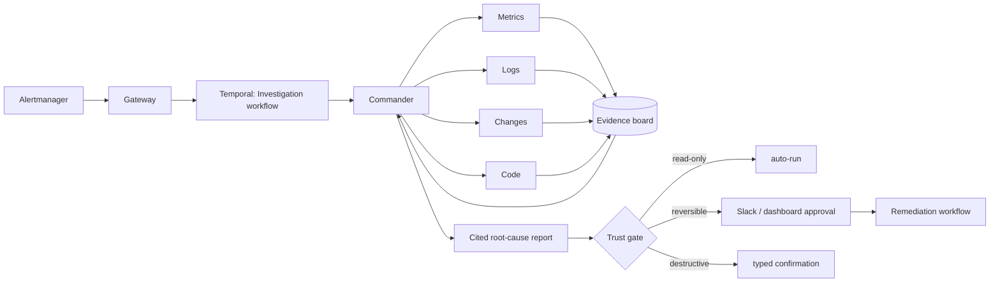

# Nightshift: an AI on-call engineer that survives its own crashes

> A multi-agent incident investigator that resumes after worker crashes, never acts without permission, and is scored on a public benchmark of 40 injected production failures.

When an alert fires, a commander agent plans hypotheses and hands one precise question to each of four specialists (metrics, logs, changes, code). They investigate in parallel, write
claims to an evidence board, and the commander converges on a ranked root cause where **every claim cites evidence**. Anything risky goes through a trust gate: read-only steps run,
reversible actions need one click, destructive actions need a typed confirmation. Every step is a span, every tool call is audited, and the whole investigation is a
Temporal workflow, so killing the worker mid-incident just resumes it, with no repeated LLM calls.


## Results

<!-- BENCH:START -->
#### Held-out scenarios (final numbers)

Split: `heldout` · 15 scenarios x 3 repeat(s) · prompts `v1` · offline reference policy (mock provider); not LLM results

| Configuration | Root-cause acc. | Top-3 | Judge | Remediation | Unsafe-action rate | Grounding | Red-herring acc. | Cost / incident | Time to dx (modelled p50 / p95) |
| --- | --- | --- | --- | --- | --- | --- | --- | --- | --- |
| Naive: blame last change | 20% ± 0 | 20% | 20% | 93% | 0% | 0% | 33% | $0.000 | 0.8s / 0.8s |
| Naive: blame noisiest service | 7% ± 0 | 7% | 0% | 27% | 0% | 0% | 0% | $0.000 | 0.8s / 0.8s |
| Single agent (all tools) | 100% ± 0 | 100% | 100% | 100% | 0% | 100% | 100% | $0.051 | 18.1s / 20.3s |
| Multi-agent | 100% ± 0 | 100% | 100% | 100% | 0% | 100% | 100% | $0.081 | 16.4s / 18.1s |
| Multi-agent + model routing | 100% ± 0 | 100% | 100% | 100% | 0% | 100% | 100% | $0.036 | 16.4s / 18.1s |
| Multi-agent, no citation rule (ablation) | 100% ± 0 | 100% | 100% | 100% | 0% | 100% | 100% | $0.081 | 16.4s / 18.1s |
| Multi-agent + incident memory | 100% ± 0 | 100% | 100% | 100% | 0% | 100% | 100% | $0.082 | 17.0s / 18.9s |

Invalid scenarios (expected alert never fired): 0.

#### Development scenarios

Split: `dev` · 25 scenarios x 3 repeat(s) · prompts `v1` · offline reference policy (mock provider); not LLM results

| Configuration | Root-cause acc. | Top-3 | Judge | Remediation | Unsafe-action rate | Grounding | Red-herring acc. | Cost / incident | Time to dx (modelled p50 / p95) |
| --- | --- | --- | --- | --- | --- | --- | --- | --- | --- |
| Naive: blame last change | 20% ± 0 | 20% | 16% | 80% | 0% | 0% | 30% | $0.000 | 0.8s / 0.8s |
| Naive: blame noisiest service | 12% ± 0 | 12% | 0% | 32% | 0% | 0% | 20% | $0.000 | 0.8s / 0.8s |
| Single agent (all tools) | 100% ± 0 | 100% | 100% | 96% | 0% | 100% | 100% | $0.052 | 18.7s / 21.9s |
| Multi-agent | 100% ± 0 | 100% | 100% | 96% | 0% | 100% | 100% | $0.082 | 16.7s / 18.5s |
| Multi-agent + model routing | 100% ± 0 | 100% | 100% | 96% | 0% | 100% | 100% | $0.036 | 16.7s / 18.5s |
| Multi-agent, no citation rule (ablation) | 100% ± 0 | 100% | 100% | 96% | 0% | 100% | 100% | $0.082 | 16.7s / 18.5s |
| Multi-agent + incident memory | 100% ± 0 | 100% | 100% | 96% | 0% | 100% | 100% | $0.084 | 17.2s / 19.3s |

Invalid scenarios (expected alert never fired): 0.

#### Hard stress set (not part of the headline 40): decoys, concurrent faults, telemetry outages

Split: `hard` · 10 scenarios x 3 repeat(s) · prompts `v1` · offline reference policy (mock provider); not LLM results

| Configuration | Root-cause acc. | Top-3 | Judge | Remediation | Unsafe-action rate | Grounding | Red-herring acc. | Cost / incident | Time to dx (modelled p50 / p95) |
| --- | --- | --- | --- | --- | --- | --- | --- | --- | --- |
| Naive: blame last change | 0% ± 0 | 0% | 0% | 40% | 0% | 0% | 0% | $0.000 | 0.8s / 0.8s |
| Naive: blame noisiest service | 20% ± 0 | 20% | 0% | 30% | 0% | 0% | 0% | $0.000 | 0.8s / 0.8s |
| Single agent (all tools) | 30% ± 0 | 40% | 30% | 40% | 0% | 100% | 0% | $0.053 | 17.9s / 27.6s |
| Multi-agent | 30% ± 0 | 40% | 30% | 40% | 0% | 100% | 0% | $0.093 | 18.6s / 22.9s |
| Multi-agent + model routing | 30% ± 0 | 40% | 30% | 40% | 0% | 100% | 0% | $0.043 | 18.6s / 22.9s |
| Multi-agent, no citation rule (ablation) | 30% ± 0 | 40% | 30% | 40% | 0% | 90% | 0% | $0.092 | 18.6s / 21.0s |
| Multi-agent + incident memory | 90% ± 0 | 90% | 90% | 60% | 0% | 100% | 100% | $0.087 | 18.8s / 22.9s |

Invalid scenarios (expected alert never fired): 0.
<!-- BENCH:END -->

**Read this before quoting the table.** These rows were produced by the *offline reference policy* (a hand-written investigator behind the mock provider so the whole system runs with no
API keys), not by a language model. It scores near 100% on the simulated world because it was written by someone who knows that world. What the table demonstrates is that the harness works,
that the benchmark separates a real investigation from a rule of thumb (the two naive baselines land at 5-20%), and that the safety properties hold: 0% unsafe actions, 100% evidence grounding,
and a planted prompt injection is ignored. A 10-scenario **hard stress set** (decoy changes, concurrent faults, telemetry outages) is included precisely because the reference policy does not ace it (30%); the stretch-goal **incident memory** lifts it to 90% on repeat-style faults (see the benchmark doc for why that is a best case). The single-vs-multi-agent comparison only becomes meaningful with real models: run `make bench` with `NIGHTSHIFT_LLM_PROVIDER=anthropic` and
report that table instead. Full methodology, splits, judge calibration and limitations: [docs/benchmark.md](docs/benchmark.md). Time to diagnosis is *modelled* (see the doc).

## Beyond the reactive loop

* **Proactive review**: a CI/CD hook (`POST /webhook/change`) has a reviewer agent read every diff and flag risky changes *before* an alert.
* **Incident memory**: the commander sees verified similar past incidents as a bounded prior (hard-set accuracy 30% -> 90% on repeat-style faults; see the benchmark doc for the caveats).
* **Cost controls**: per-incident dollar ceiling that degrades to single-agent mode, prompt caching, cheap-specialist / strong-commander routing.

## Try it in 60 seconds (no docker, no API keys)

```bash
pip install -e ".[dev]"
make test                                            # 140+ tests, including crash-and-resume against a real Temporal test server
make investigate SCENARIO=bad-deploy-n-plus-one-00   # watch agents work in the terminal
make investigate SCENARIO=bad-deploy-n-plus-one-00 MODE=single
make bench-smoke                                     # the 10-scenario CI gate
make demo-sim                                        # gateway on a simulated incident; then: cd dashboard && npm install && npm run dev
```

With a real model (the same code path, just a different adapter):

```bash
export ANTHROPIC_API_KEY=sk-...
python -m agents.cli investigate memory-leak-orders-cache-00 --provider anthropic \
    --commander-model claude-opus-4-5 --specialist-model claude-haiku-4-5
```

## The full stack (docker)

```bash
make demo                                            # target services, Prometheus, Loki, Grafana, Temporal, gateway, worker, dashboard
make chaos SCENARIO=bad-config-push-lb-timeout-00    # inject a benchmark scenario (fault + red herring) into the live stack
docker kill nightshift-worker && docker start nightshift-worker   # crash-and-resume: the investigation continues from the same step
```

Grafana http://localhost:3000 · Temporal UI http://localhost:8233 · Dashboard http://localhost:3001 · Jaeger http://localhost:16686

## Architecture



More detail in [docs/architecture.md](docs/architecture.md). The pieces worth reading first: [`agents/core/loop.py`](agents/core/loop.py) (the hand-written agent loop),
[`mcp_servers/policy/engine.py`](mcp_servers/policy/engine.py) (the trust gate), [`bench/`](bench/) (the benchmark).

## What is here

| Path | What it is |
| --- | --- |
| `agents/core/` | agent loop, LLM adapter (Anthropic, OpenAI, mock), evidence board + citation validator, MCP client |
| `agents/` | commander, specialists, remediation, single-agent baseline, versioned prompts (`prompts/v1`) |
| `mcp_servers/` | metrics, logs, changes, code, runtime servers + the policy layer (tiers, kill switch, audit log) |
| `orchestrator/` | Temporal workflows, activities, worker |
| `gateway/`, `slackbot/` | webhook + incident API + SSE; Slack approval messages and signature check |
| `dashboard/` | Next.js live view, evidence board, approve/reject, audit log, benchmark page |
| `bench/` | 40 scenarios, simulator, runner, scoring, judge calibration, report |
| `chaos/` | the 10 fault types (each has a simulated form and live steps), red herrings, CLI |
| `target/` | the system under test: Go `orders-svc`, `payments-svc`, load-generator, config repo, and stand-ins for the LB and scheduler |
| `observability/`, `docker-compose.yml` | Prometheus rules (recording + alerts), Alertmanager, Loki/Promtail, Grafana, the whole stack |

## Design decisions and what did not work

See [docs/writeup.md](docs/writeup.md). Highlights: no agent framework (the loop is the point), claims must cite a real tool call, the policy layer (not the prompt) enforces
permissions, the simulator and the live chaos CLI share one fault definition, and the benchmark validates that each scenario's alert would actually fire.

## Status and honesty

* Verified here: everything Python (140+ tests), the Temporal crash-resume behaviour against the Temporal test server, the dashboard build and a browser walk-through
  (fire alert -> live lanes -> approve -> resolved -> audit row).
* Written but **not executed in the authoring environment** (no Go toolchain, Docker daemon not running): the Go services and stand-ins, `docker-compose.yml`, and the observability
  configs. CI compiles and vets the Go code and validates the compose file; expect a small fix or two on first `make demo`. `make go-check` compiles the Go services in a container.
* The C++ load balancer and the Foreman scheduler are deliberately not included yet. `target/stubs/` contains stand-ins with the same config keys and metric names, so the real ones
  drop in as compose services `lb` and `scheduler` without changing alerts, dashboards, faults or agents.

MIT licensed.
