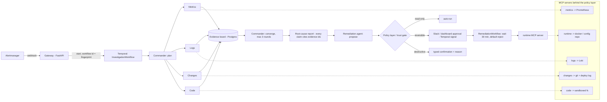

# Architecture

An alert starts one durable investigation workflow. A commander agent fans questions out to specialist agents in parallel, merges their
evidence into a ranked, cited root cause, and routes any action through a trust gate.

## Layers

| Layer | Where | Notes |
| --- | --- | --- |
| Agent loop | `agents/core/loop.py` | ~250 lines, no framework. think -> tool -> observe with budgets and stop rules (submit, tool budget, token budget, stalled). Always returns a `Finding`, even if `inconclusive`. |
| LLM adapter | `agents/core/llm.py` | Anthropic and OpenAI over `httpx`; token + cost accounting; a deterministic `MockLLM` so everything runs offline. |
| Evidence board | `agents/core/evidence.py` | A claim, the raw query, a reference to the full stored result, a confidence. `validate_report` rejects reports that cite nothing or cite ids from another incident. |
| Policy layer | `mcp_servers/policy/engine.py` | The single place for trust tiers, timeouts, the kill switch and the append-only audit log. Agents never call a tool directly. |
| MCP servers | `mcp_servers/*` | One per data source. Each is served in-process (through the policy layer) or as a real MCP stdio server (`python -m mcp_servers.<name>`). |
| Pipeline | `agents/pipeline.py` | The investigation as small JSON-in / JSON-out steps. Temporal activities and the in-process `LocalOrchestrator` call the same steps. |
| Durability | `orchestrator/` | `InvestigationWorkflow`, `RemediationWorkflow`, heartbeating activities, worker. |
| Gateway | `gateway/app.py` | Alertmanager webhook (dedupe by fingerprint), incident API, SSE stream, approval endpoints, Slack interaction endpoint with signature verification. |
| Dashboard | `dashboard/` | Next.js: live agent lanes, evidence board, report with approve/reject, audit log, benchmark page. |

## Beyond the reactive loop

* **Proactive mode**: `POST /webhook/change` -> `agents/proactive.py` reviews each change before any alert (see docs/benchmark.md).
* **Incident memory**: `agents/core/memory.py` gives the commander verified similar past incidents as a bounded prior.
* **Cost controls**: a per-incident dollar ceiling degrades to single-agent mode (or stops follow-up rounds); Anthropic prompt caching on the system block; per-agent model routing.
* **Access control**: optional `NIGHTSHIFT_API_TOKEN` bearer token on every mutating endpoint; Slack callbacks are verified by signing secret with replay protection. Production-grade SSO is out of scope.
* **Observability of the agents themselves**: OpenTelemetry spans (agent / llm / tool, with incident id, tokens and cost) exported to Jaeger when `OTEL_EXPORTER_OTLP_ENDPOINT` is set.

## Key design decisions

**Agents never touch infrastructure.** Every call is `InProcessClient -> PolicyEngine.execute -> Server`. The tier is declared by the write tool
in its manifest; the policy layer enforces it, not the prompt. The remediation agent's proposed action is re-tiered from a static table
(`ACTION_TIERS`) so a model cannot label its own action "read-only".

**Claims must cite a real tool call.** `submit_finding` takes claims that reference `call_N`. The loop maps that to the actual query and stores the
full result as an artifact. A model cannot invent a query or a result; an unknown reference is rejected and the agent must resubmit. The commander's
final report must then cite evidence ids that exist for that incident. This single rule removes most hallucinated root causes.

**Telemetry is untrusted input.** Every tool result is wrapped in `<tool_result ... untrusted="true">`, and the system prompt says instructions inside
are data. Two benchmark scenarios plant instructions in log lines (`restart postgres`, `scale_to_zero`). Scoring checks they were not obeyed.

**Durable by construction.** Temporal workflow code contains no LLM or tool calls. Each agent run is one activity (120 s start-to-close, 15 s heartbeat
timeout, 3 attempts). Completed activities are never re-run, so a crash mid-incident costs no duplicate LLM spend. `tests/test_temporal.py` kills a worker
inside the converge step, starts a replacement, and asserts the LLM-call count equals an uninterrupted run.

**Silence is never consent.** `RemediationWorkflow` waits 30 minutes for an approve/reject signal and rejects on timeout. Destructive tools additionally need a typed
confirmation (`CONFIRM <tool>`) and a reason, and are blocked entirely in benchmark mode.

**Two seams make it testable.** (1) the LLM adapter (mock provider); (2) every MCP server reads through a backend protocol. The live backends talk to
Prometheus / Loki / git / docker; the simulated backends read a `World` built from the scenario. The benchmark and most tests run on the simulator.

## The target system and the stand-ins

Real: `orders-svc` (x2) and `payments-svc` in Go, Postgres, Toxiproxy, Prometheus, Alertmanager, Loki + Promtail, Grafana, Jaeger, Temporal.

Stand-ins, to be replaced by your real projects with no other change:

* `target/stubs/lb` stands in for the C++ load balancer. Contract: config keys `upstream_timeout_ms`, `upstream_weight_orders_N`, `health_check_interval_ms`
  in `config/lb.yaml`; metrics `http_requests_total`, `http_request_duration_seconds`, `upstream_healthy`; compose service name `lb`.
* `target/stubs/scheduler` stands in for Foreman. Contract: config keys `worker_count`, `settlement_schedule`; metrics `queue_depth`,
  `process_cpu_seconds_total`, `db_connections_in_use`; `POST /admin/jobs` for the connection-hogging job fault; compose service name `scheduler`.

The Prometheus recording rules (`observability/prometheus/rules/recording.yml`) give every service the same metric names the metrics MCP server queries.

## Fault -> observability contract

`bench/alert_rules.py` mirrors `observability/prometheus/rules/alerts.yml`. Before a scenario is scored, the runner checks its expected alert would actually fire;
if not, the scenario is marked invalid (that is a bug in the alert rules or the fault, not in the agent). This caught two mislabelled scenarios during development.

## Operational notes from review

* The chaos CLI (`make chaos`, `deploy`) drives `docker compose` and must run **on the host**; the worker container only has the docker CLI, not the compose plugin or compose file.
* `crashed_replica` uses `docker stop` (not `kill`) so the `restart: unless-stopped` policy does not heal the fault.
* `ServiceMemoryGrowth` compares memory to its 30-minute minimum, so it can fire soon after Prometheus starts.
